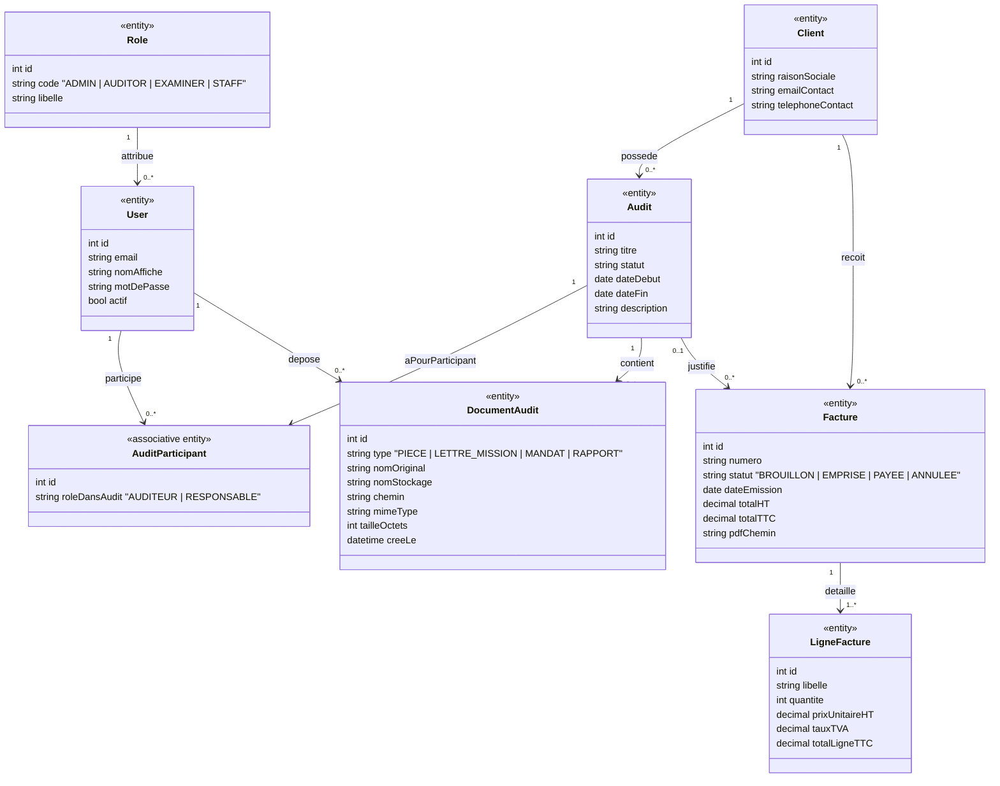

# MCD Cassandre

```mermaid
classDiagram

%% ======= Entities =======

class Role {
  <<entity>>
  int id
  string code "ADMIN | AUDITOR | EXAMINER | STAFF"
  string libelle
}

class User {
  <<entity>>
  int id
  string email
  string nomAffiche
  string motDePasse
  bool actif
}

class DocumentAudit {
  <<entity>>
  int id
  string type "PIECE | LETTRE_MISSION | MANDAT | RAPPORT"
  string nomOriginal
  string nomStockage
  string chemin
  string mimeType
  int tailleOctets
  datetime creeLe
}

class Client {
  <<entity>>
  int id
  string raisonSociale
  string emailContact
  string telephoneContact
}

class AuditParticipant {
  <<associative entity>>
  int id
  string roleDansAudit  "AUDITEUR | RESPONSABLE"
}

class Audit {
  <<entity>>
  int id
  string titre
  string statut
  date dateDebut
  date dateFin
  string description
}

class Facture {
  <<entity>>
  int id
  string numero
  string statut "BROUILLON | EMPRISE | PAYEE | ANNULEE"
  date dateEmission
  decimal totalHT
  decimal totalTTC
  string pdfChemin
}

class LigneFacture {
  <<entity>>
  int id
  string libelle
  int quantite
  decimal prixUnitaireHT
  decimal tauxTVA
  decimal totalLigneTTC
}

%% ======= Relations =======

Role  "1" --> "0..*" User : attribue
Client "1" --> "0..*" Audit : possede

Audit "1" --> "0..*" AuditParticipant : aPourParticipant
User "1" --> "0..*" AuditParticipant : participe

Audit "1" --> "0..*" DocumentAudit : contient
User  "1" --> "0..*" DocumentAudit : depose

Client "1" --> "0..*" Facture : recoit
Audit  "0..1" --> "0..*" Facture : justifie
Facture "1" --> "1..*" LigneFacture : detaille
```

Pourquoi ce MCD “fonctionne” pour la planification :

- CRUD clients + audits: **Client** et **Audit**
- Auditeur: **Auditor** (plus simple à gérer que du “many-to-many” brut)
- Upload: **DocumentAudit** lié à Audit et à l’utilisateur qui l’a déposé
- Factures: **Facture** + **LigneFacture**, liées à Client (et optionnellement à Audit)
- Rôles et accès: **Role** + **User**

<a href="#">üîù Retour en haut</a>

